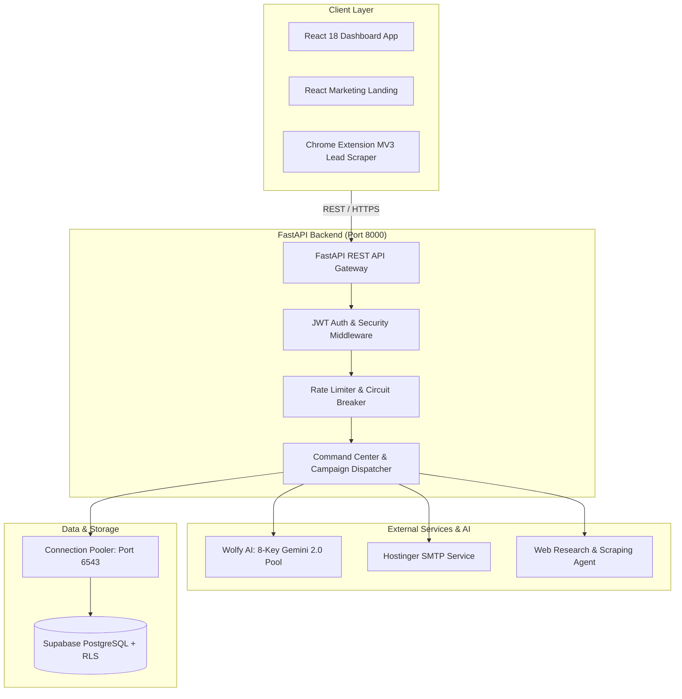

# 🐺 WolfAssistants - AI Email Automation Platform

<div align="center">


[](https://fastapi.tiangolo.com)
[](https://www.python.org/)
[](https://react.dev/)
[](https://www.typescriptlang.org/)
[](https://tailwindcss.com/)
[](https://supabase.com/)
[](https://deepmind.google/technologies/gemini/)
[](https://developer.chrome.com/docs/extensions/mv3/)

**Enterprise-grade, autonomous cold outreach, lead scraping, and context-aware email generation platform powered by multi-key load-balanced Google Gemini AI.**

[Features](#-key-features) • [Architecture](#-architecture) • [Directory Structure](#-directory-structure) • [Git Hygiene](#-git-hygiene--commit-policy) • [Quick Start](#-quick-start) • [Environment Config](#-environment-variables) • [Database](#-database-setup--migrations) • [Chrome Extension](#-chrome-extension) • [Deployment](#-production-deployment)

</div>

---

## 🌟 Overview

**WolfAssistants** is a full-stack, enterprise-ready email automation platform designed for modern sales, marketing, and recruitment teams. It combines intelligent AI generation, real-time web research, autonomous follow-ups, and deliverability monitoring into a single unified dashboard, accompanied by a Chrome Manifest V3 extension for frictionless lead capture.

### Key Capabilities
- 🤖 **Wolfy AI Engine**: Google Gemini 2.0 Flash integration with an **8-key automatic failover and load balancing pool** for uninterrupted AI generation.
- 🛡️ **Multi-Tenant Data Isolation**: Database-level security built on PostgreSQL with Supabase Row-Level Security (RLS).
- 📧 **Enterprise SMTP & IMAP**: Hostinger SMTP for system emails & OTPs, plus per-tenant IMAP/SMTP inbox syncing and reply detection.
- 🌐 **Chrome Lead Scraper**: Manifest V3 extension to extract verified lead contacts directly into campaigns.
- 📊 **Deliverability & Warmup**: Smart throttling, connection pooling, and circuit breaker guardrails to safeguard inbox reputation.

---

## 🏗️ Architecture



---

## 📁 Directory Structure

```text
WolfAssistants/
├── .agents/                      # Project memory & agent guidelines
│   └── AGENTS.md                 # Core system architecture & configurations
├── .gitignore                    # Master root git ignore configuration
├── pyrightconfig.json            # Python language server typing configuration
├── README.md                     # Master project documentation (this file)
└── Email Automation/             # Main application codebase
    ├── backend/                  # FastAPI Python backend service
    │   ├── app/                  # Core application package
    │   │   ├── api/v1/           # REST endpoints (auth, campaigns, leads, ai, etc.)
    │   │   ├── core/             # Config, security, database engine, AI pool
    │   │   ├── middleware/       # Security headers, rate limiting, logging
    │   │   ├── models/           # SQLAlchemy ORM models
    │   │   ├── monitoring/       # Health checks and audit logging
    │   │   └── schemas/          # Pydantic validation schemas
    │   ├── migrations/           # Database migration files
    │   ├── .env.example          # Sanitized backend environment template
    │   ├── .gitignore            # Backend-specific ignore file
    │   ├── main.py               # Application entrypoint
    │   ├── requirements.txt      # Python package dependencies
    │   ├── run_migration.py      # Automated database migration runner
    │   └── vercel.json           # Backend serverless deployment config
    ├── frontend/                 # React 18 TypeScript web dashboard
    │   ├── public/               # Public assets & HTML template
    │   ├── src/                  # React components, contexts, hooks, services
    │   ├── .env.example          # Frontend environment template
    │   ├── .gitignore            # Frontend-specific ignore file
    │   ├── package.json          # Node dependencies & scripts
    │   ├── tailwind.config.js    # Tailwind styling tokens
    │   └── tsconfig.json         # TypeScript configuration
    ├── landing/                  # Standalone marketing landing page
    │   ├── components/           # Landing page UI components
    │   ├── public/               # Landing assets
    │   ├── src/                  # App components and layout
    │   ├── .env.example          # Landing environment template
    │   ├── .gitignore            # Landing-specific ignore file
    │   └── package.json          # Landing dependencies & scripts
    ├── extension/                # Chrome Extension (Manifest V3)
    │   ├── background.js         # Service worker & background tasks
    │   ├── content.js            # In-page lead scraper script
    │   ├── manifest.json         # MV3 Chrome extension manifest
    │   ├── popup.html            # Extension popup interface
    │   ├── popup.js              # Extension UI controller
    │   └── icons/                # Extension branding icons
    ├── scripts/                  # DevOps, deployment templates, and build tests
    └── Research/                 # Market research and competitive analysis
```

---

## 🔒 Git Hygiene & Commit Policy

To guarantee security, repository hygiene, and zero secret leakage, the following commit policies are strictly enforced across the repository:

### ❌ Excluded Files (NEVER Commit)
| Category | File / Pattern | Reason |
| :--- | :--- | :--- |
| **Secrets & Keys** | `.env`, `.env.local`, `.env.*.local`, `*.pem`, `*.key` | Contains live API keys, JWT secrets, DB passwords |
| **Virtual Environments** | `venv/`, `.venv/`, `env/` | System-specific Python runtime binaries |
| **Node Packages** | `node_modules/`, `.pnp.*` | Heavy 3rd party dependencies (use `npm install`) |
| **Build Artifacts** | `frontend/build/`, `dist/`, `.next/` | Generated static bundles (use `npm run build`) |
| **Databases & Caches** | `backend/*.db`, `local_dev.db`, `local_test.db` | Local database storage files |
| **Logs & Audits** | `*.log`, `logs/`, `audit.log` | Execution logs and debug outputs |
| **Python Bytecode** | `__pycache__/`, `*.pyc`, `.pytest_cache/` | Python compiled bytecode |
| **User Settings** | `.vscode/`, `.cursor/`, `.idea/`, `.DS_Store` | Local IDE preferences and OS artifacts |

### ✅ Included Files (Safe to Commit)
- Full source code (`backend/app/`, `frontend/src/`, `landing/`, `extension/`)
- Sanitized templates (`.env.example`)
- Package lock files (`package.json`, `package-lock.json`, `requirements.txt`)
- Schema migrations & SQL scripts (`backend/migrations/`, `*.sql`)
- Documentation, architecture plans, and guides (`README.md`, `SETUP.md`, `.agents/AGENTS.md`)

---

## 🚀 Quick Start

### Prerequisites
- **Python**: 3.10 to 3.13+
- **Node.js**: 18+ & **npm** 9+
- **Database**: PostgreSQL (Supabase recommended)
- **API Keys**: Google Gemini API key(s)

---

### 1. Backend Setup

```bash
# Navigate to backend directory
cd "Email Automation/backend"

# Create and activate Python virtual environment
# Windows (PowerShell):
python -m venv venv
venv\Scripts\Activate.ps1

# Linux / macOS:
# python3 -m venv venv
# source venv/bin/activate

# Install dependencies
pip install -r requirements.txt

# Create environment file from template
copy .env.example .env     # On Windows
# cp .env.example .env     # On Linux/macOS
```

> Open `.env` and fill in your Supabase `DATABASE_URL`, `GEMINI_API_KEY_1`, and `SECRET_KEY`.

```bash
# Run database schema migrations
python run_migration.py

# Start FastAPI development server
python main.py
```
Backend API will be live at: **`http://localhost:8000`**  
Interactive API Docs (Swagger): **`http://localhost:8000/docs`**

---

### 2. Frontend Setup

```bash
# In a new terminal, navigate to frontend directory
cd "Email Automation/frontend"

# Install npm packages
npm install

# Create environment configuration
copy .env.example .env

# Start React development server
npm start
```
Frontend Dashboard will be live at: **`http://localhost:3000`**

---

### 3. Landing Page Setup

```bash
# Navigate to landing directory
cd "Email Automation/landing"

# Install dependencies
npm install

# Start development server
npm start
```
Marketing Landing Page will run on an available port (e.g., **`http://localhost:3001`**).

---

### 4. Chrome Extension Installation

1. Open Google Chrome and navigate to `chrome://extensions/`.
2. Enable **Developer mode** in the top right corner.
3. Click **Load unpacked**.
4. Select the directory: `WolfAssistants/Email Automation/extension`.
5. The **WolfAssistants Lead Scraper** icon will appear in your Chrome toolbar.

---

## ⚙️ Environment Variables

### Backend Configuration (`backend/.env`)

| Variable | Type | Description | Example / Default |
| :--- | :--- | :--- | :--- |
| `ENVIRONMENT` | `string` | Environment stage (`development` / `production`) | `development` |
| `PORT` | `int` | Server listening port | `8000` |
| `SECRET_KEY` | `string` | Cryptographic secret for signing sessions | `32+ character random string` |
| `DATABASE_URL` | `string` | Supabase / PostgreSQL connection URI | `postgresql+psycopg://postgres...` |
| `CORS_ORIGINS` | `string` | Comma-separated list of allowed web origins | `http://localhost:3000,http://localhost:8000` |
| `GEMINI_API_KEY_1..8` | `string` | Google Gemini API keys for the 8-key failover pool | `AIzaSy...` |
| `SYSTEM_EMAIL_HOST` | `string` | Hostinger / SMTP server host | `smtp.hostinger.com` |
| `SYSTEM_EMAIL_PORT` | `int` | SMTP port (587 for TLS, 465 for SSL) | `587` |
| `SYSTEM_EMAIL_USER` | `string` | System email address for OTPs/notifications | `info@wolfassistants.com` |
| `SYSTEM_EMAIL_PASSWORD` | `string` | SMTP password / app password | `your-smtp-password` |
| `SYSTEM_EMAIL_USE_TLS` | `bool` | Enable TLS security | `true` |
| `JWT_SECRET_KEY` | `string` | Secret key for JWT token hashing | `your-jwt-secret` |
| `JWT_ALGORITHM` | `string` | Algorithm for JWT tokens | `HS256` |
| `CIRCUIT_BREAKER_ENABLED`| `bool` | Enable AI and SMTP circuit breaker protection | `true` |

### Frontend & Landing Configuration (`.env`)

| Variable | Type | Description | Default |
| :--- | :--- | :--- | :--- |
| `REACT_APP_API_URL` | `string` | Target FastAPI backend URL | `http://localhost:8000` |

---

## 🗄️ Database Setup & Migrations

WolfAssistants uses **Supabase PostgreSQL** with connection pooling and multi-tenant schema isolation.

### SQLAlchemy Connection Pooling Guardrails
```python
# Tuned for Supabase Free-Tier & Serverless Limits
engine = create_engine(
    DATABASE_URL,
    pool_size=10,        # Base pool connection count
    max_overflow=5,      # Max temporary burst connections
    pool_recycle=1800,   # Recycle idle connections every 30 mins
    pool_pre_ping=True   # Automatically test connection health
)
```

### Running Migrations & Indexing
```bash
cd "Email Automation/backend"

# Apply all pending schema updates
python run_migration.py

# Enable Row-Level Security (RLS) policies
python enable_rls_migration.py

# Add performance indexes for high-throughput queries
python add_performance_indexes.py
```

---

## 🧩 Chrome Extension Usage

1. Open the extension popup from the browser bar.
2. Log in using your WolfAssistants credentials or API Token.
3. Browse to any target professional directory or lead page.
4. Click **Extract Leads** to automatically parse names, titles, company data, and email addresses.
5. Select the target campaign in WolfAssistants to immediately sync your scraped leads into the AI outreach pipeline.

---

## 🛡️ Security & Performance

- **Password Security**: Passwords hashed with `bcrypt` (work factor 12).
- **Session Authentication**: Short-lived JWT tokens signed with `HS256`.
- **Content Security Policy (CSP)**: Strict headers configured via custom FastAPI middleware.
- **Circuit Breaker**: Detects API rate limits or downstream failures and pauses outbound traffic to prevent cascading service degradation.
- **Failover Pool**: Intelligent key rotation for Gemini AI ensures 99.9% uptime during large email generation batches.

---

## 🚢 Production Deployment

### Frontend (Vercel)
1. Push your repository to GitHub (`https://github.com/wolfychristo/WolfAssistants.git`).
2. Import project into [Vercel](https://vercel.com).
3. Set **Root Directory** to `Email Automation/frontend`.
4. Add Environment Variable: `REACT_APP_API_URL = https://your-backend-api.com`.
5. Deploy.

### Backend (Cloud VM / Render / Railway / Docker)
1. Configure your production environment variables in your hosting provider's secrets manager.
2. Ensure database URL connects through Supabase's transaction pooler (`aws-0-*.pooler.supabase.com:6543`).
3. Launch with Uvicorn:
   ```bash
   uvicorn main:app --host 0.0.0.0 --port 8000 --workers 4
   ```

---

## 🤝 Contributing

1. Fork the repository
2. Create your feature branch (`git checkout -b feature/AmazingFeature`)
3. Commit your changes (`git commit -m 'feat: Add AmazingFeature'`)
4. Push to the branch (`git push origin feature/AmazingFeature`)
5. Open a Pull Request

---

## 📄 License

This project is licensed under the MIT License. See the `LICENSE` file for details.

<div align="center">
  <sub>Built with ❤️ by the WolfAssistants Engineering Team.</sub>
</div>
